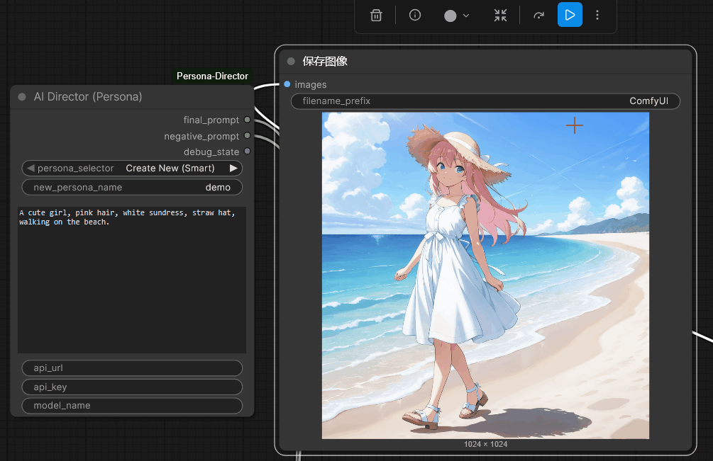

# ComfyUI-Persona-Director

> **The Visual State Machine for Consistent Character Generation.**

[](https://opensource.org/licenses/Apache-2.0)
[](https://github.com/comfyanonymous/ComfyUI)
[]()

---

## Demo

**Watch consistency in action.** *(The character identity and outfit persist perfectly while the pose changes.)*



> **"She takes off the hat."** > — The Agent intelligently removes the `straw hat` from the outfit list, but keeps the `white sundress` and character identity exactly the same.

---

## Why This Node?

In standard Stable Diffusion workflows, changing a prompt often changes the entire character (random seed chaos).  
**Persona Director** solves this by maintaining a **7-Layer Deterministic State Machine**:

| Layer | Function |
| :--- | :--- |
| **Character** | Identity tags (e.g., `hatsune_miku`, `1girl`) are locked. |
| **Outfit** | Clothes are tracked as a set. Change pose without changing clothes. |
| **Action** | Updates pose/expression independently. |
| **Location** | Backgrounds persist until you say "go somewhere else". |
| **Composition** | Camera angles and framing. |
| **Style** | Art style consistency. |
| **JSON State** | All data is saved to `.json`. You can pause and resume days later. |

---

## Installation

### Method 1: Via ComfyUI Manager (Recommended)
The easiest way to install.
1. Open **ComfyUI Manager**.
2. Click **"Install Custom Nodes"**.
3. Search for: `Persona Director` (or `ComfyUI-Persona-Director`).
4. Click **Install**.
5. **Restart** ComfyUI.

*(Dependencies like `openai` will be installed automatically if you use the Manager.)*

### Method 2: Manual Installation
Use this if you prefer the terminal or want to contribute to the code.

1.  **Navigate to your ComfyUI custom nodes directory:**
    ```bash
    cd ComfyUI/custom_nodes
    ```

2.  **Clone this repository:**
    ```bash
    git clone [https://github.com/YOUR_USERNAME/ComfyUI-Persona-Director.git](https://github.com/YOUR_USERNAME/ComfyUI-Persona-Director.git)
    ```

3.  **Install dependencies:**
    ```bash
    pip install openai
    ```
    *(Note: We use the `openai` library, but it supports Gemini, DeepSeek, Claude, and Local LLM via compatible endpoints.)*

4.  **Restart ComfyUI.**

---

## Configuration (Auto-Setup)

**Protect your keys!** We use a secure local config file so you don't leak API keys in workflow screenshots.

1.  **Run the node once**: Just try to generate an image. The node will automatically create a `config.json` file in the folder for you and show an error to remind you.
2.  **Edit the file**: Open `ComfyUI/custom_nodes/ComfyUI-Persona-Director/config.json` and fill in your details:

```json
{
    "api_url": "[https://api.openai.com/v1](https://api.openai.com/v1)",
    "api_key": "sk-proj-xxxxxxxxxxxxxxxxxxxxxxxx",
    "model_name": "gpt-4o"
}
```
**Supported Models / Providers Cheat Sheet**

    OpenAI
    Google Gemini
    DeepSeek / Claude (via OpenRouter)
    Local LLM

---

## Quick Start (Drag & Drop)

**Get started immediately!** Download the image below (Save As...), then **drag and drop it directly into ComfyUI**.  
It contains the full node setup and metadata.


> **Alternative**: If the image doesn't load, you can download the [Raw Workflow JSON here](assets/workflow_basic.json) and load it manually.

*(Note: Ensure you have set up your `config.json` before running)*

---

## How to Use

### 1. Create a Character
* **Selector**: Choose `Create New (Smart)`.
* **Instruction**: *"A cyberpunk girl, blue neon jacket, holding a katana."*
* **Generate**: The node creates `New_Character.json`.

### 2. Update the Scene (The Magic)
* **Selector**: **Keep it on `Create New (Smart)`** (It automatically detects existing files). **Or, refresh comfyUI and select the json`** 
* **Instruction**: *"She is crouching on a rooftop."*
* **Result**: The `blue neon jacket` and `katana` are preserved. Only the pose and background change.

### 3. Advanced Logic
* **Remove Items**: *"She puts away her weapon."* -> AI removes `katana`.
* **Environment**: *"It starts raining."* -> AI adds `rain` to location.
* **Tag Injection**: For precise control, use the `tag:(...)` syntax to force specific tags into the prompt.
    * Input: *"She is eating. tag:(hamburger, open_mouth)"*
---

## Troubleshooting

* **Error: 404 Not Found**:
    * Check your `api_url`. If using Google, it must end with `/openai/`. If using OpenRouter/OneAPI, it usually ends with `/v1`.
    * Check your `model_name`. OpenRouter often requires the vendor prefix (e.g., `google/gemini-pro`).
* **Error: 401 Unauthorized**: Check your API Key.
* **"The wind blows her hat away" but the hat stays?**:
    * The model prioritizes consistency. Try being more explicit: *"The wind blows her hat away, removing it."*

---

## License

**Apache 2.0 License**.  
Free for commercial and non-commercial use.