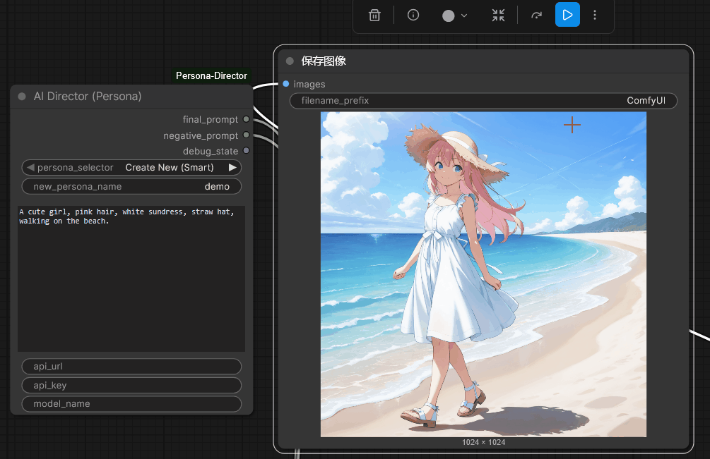

# ComfyUI-Persona-Director

> **The Visual State Machine for Consistent Character Generation** — now for both **tag** (SDXL / Pony) and **natural-language** (DiT: Anima, FLUX, SD3…) models.

[](https://opensource.org/licenses/Apache-2.0)
[](https://github.com/comfyanonymous/ComfyUI)
[]()

---

## Demo

**Watch consistency in action.** *(The character identity and outfit persist perfectly while the pose changes.)*



> **"She takes off the hat."** > — The Agent intelligently removes the `straw hat` from the outfit list, but keeps the `white sundress` and character identity exactly the same.

---

## Two Nodes

| Node | Output | For |
| :--- | :--- | :--- |
| **AI Director (Tags)** | Danbooru / SDXL tags | SDXL, Pony |
| **AI Director (NL / DiT)** | Natural language | Anima, FLUX, SD3, and other natural-language DiT models |

Both share one engine — the state schema and prompt style are driven by a `configs/*.json` profile, so you can add your own models or fields without touching code.

---

## Why This Node?

In standard Stable Diffusion workflows, changing a prompt often changes the entire character (random seed chaos).
**Persona Director** fixes this with a **config-driven deterministic state machine**:

- **Identity, outfit, action, location, composition, style** — each is a field in a JSON state. Change the pose without losing the clothes.
- The field list is **not hardcoded** — it lives in `configs/*.json`, so you can add / rename fields (e.g. `lighting`, `color`, `mood` for natural-language models) without touching code.
- State is saved to `.json` — pause and resume days later.

### Tool Calling (higher accuracy)

The LLM updates the state via **function calling**: it emits only the fields that change, validated against a JSON schema — no more re-echoing the whole JSON.

- **Capable models** → tool call (faster, more accurate).
- **Low-capability / local models** without tool support → automatically falls back to JSON echo.
- Switch manually with the `tool_mode` dropdown: `auto` / `tool` / `json_only`.

---

## Installation

### Method 1: Via ComfyUI Manager (Recommended)
The easiest way to install.
1. Open **ComfyUI Manager**.
2. Click **"Install Custom Nodes"**.
3. Search for: `Persona Director` (or `ComfyUI-Persona-Director`).
4. Click **Install**.
5. **Restart** ComfyUI.

*(Dependencies like `openai` will be installed automatically if you use the Manager.)*

### Method 2: Manual Installation
Use this if you prefer the terminal or want to contribute to the code.

1.  **Navigate to your ComfyUI custom nodes directory:**
    ```bash
    cd ComfyUI/custom_nodes
    ```

2.  **Clone this repository:**
    ```bash
    git clone https://github.com/18yz153/ComfyUI-Persona-Director.git
    ```

3.  **Install dependencies:**
    ```bash
    pip install openai
    ```

4.  **Restart ComfyUI.**

---

## Configuration (Auto-Setup)

**Protect your keys!** We use a secure local config file so you don't leak API keys in workflow screenshots.

1.  **Run the node once**: Just try to generate an image. The node will automatically create a `config.json` file in the folder for you and show an error to remind you.
2.  **Edit the file**: Open `ComfyUI/custom_nodes/ComfyUI-Persona-Director/config.json` and fill in your details:

```json
{
    "api_url": "https://api.openai.com/v1",
    "api_key": "sk-proj-xxxxxxxxxxxxxxxxxxxxxxxx",
    "model_name": "gpt-4o"
}
```

**Supported Providers / Models**

The node speaks the standard **OpenAI-compatible protocol**, so anything that exposes it works out of the box:

| Provider | Notes |
| :--- | :--- |
| OpenAI | `gpt-4o`, etc. |
| Google Gemini | via the OpenAI-compatible `/openai/` endpoint |
| DeepSeek / Claude | via OpenRouter (or compatible endpoints) |
| **LM Studio / Local LLM** | `api_url = http://localhost:1234/v1` — also Ollama, vLLM |

For local / DiT natural-language work, point the **AI Director (NL / DiT)** node at your local endpoint with the `nl.json` profile.

---

## Quick Start (Drag & Drop)

**Get started immediately!** Download the image below (Save As...), then **drag and drop it directly into ComfyUI**.
It contains the full node setup and metadata.


> **Alternative**: If the image doesn't load, you can download the [Raw Workflow JSON here](assets/workflow_basic.json) and load it manually.

*(Note: Ensure you have set up your `config.json` before running)*

---

## How to Use

### 1. Create a Character
* **Selector**: Choose `Create New (Smart)`.
* **Instruction**: *"A cyberpunk girl, blue neon jacket, holding a katana."*
* **Generate**: The node creates `New_Character.json`.

### 2. Update the Scene (The Magic)
* **Selector**: **Keep it on `Create New (Smart)`** (It automatically detects existing files). **Or, refresh comfyUI and select the json**
* **Instruction**: *"She is crouching on a rooftop."*
* **Result**: The `blue neon jacket` and `katana` are preserved. Only the pose and background change.

### 3. Advanced Logic
* **Remove Items**: *"She puts away her weapon."* -> AI removes `katana`.
* **Environment**: *"It starts raining."* -> AI adds `rain` to location.
* **Tag Injection**: For precise control, use the `tag:(...)` syntax to force specific tags into the prompt.
    * Input: *"She is eating. tag:(hamburger, open_mouth)"*

### 4. Natural-Language (DiT) Models
* Pick the **AI Director (NL / DiT)** node and the `nl.json` profile — same workflow, prose output for Anima / FLUX / SD3 and other natural-language models.

### 5. Tool Mode
* Leave `tool_mode` on `auto` for normal use.
* Set it to `json_only` for models that do not support function calling (many small / older local models).

---

## Troubleshooting

* **Error: 404 Not Found**:
    * Check your `api_url`. If using Google, it must end with `/openai/`. If using OpenRouter/OneAPI, it usually ends with `/v1`.
    * Check your `model_name`. OpenRouter often requires the vendor prefix (e.g., `google/gemini-pro`).
* **Error: 401 Unauthorized**: Check your API Key.
* **"The wind blows her hat away" but the hat stays?**:
    * The model prioritizes consistency. Try being more explicit: *"The wind blows her hat away, removing it."*
* **Local model (LM Studio / Ollama) misbehaves on tool calls?**
    * Tool calling is only reliable for models that support it. Set `tool_mode = json_only` to force the JSON-echo path.
    * `tool_choice` is sent as a plain string (LM Studio rejects the object form) — already handled by the node.

---

## License

**Apache 2.0 License**.
Free for commercial and non-commercial use.
